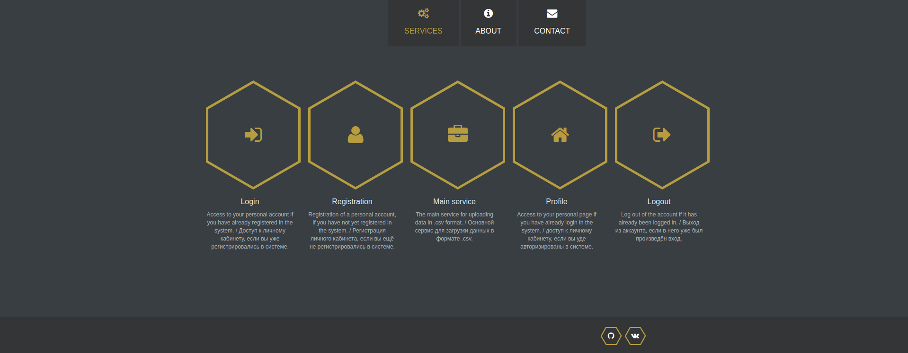

# Проект CSV_Service

Проект реализован с использованием:

- Python
- Django
- Django REST framework
- whitenoise
- gunicorn
- Docker

Все действия могут быть совершены, используя реализованный фронтенд-интерфейс, переход на который производится при заходе на адрес запущенного сервера. Всем посетителям доступна опция "Main service", которая позволяет загружать файлы на сервер, а для авторизированных пользователей доступен "Profile", где в зависимости от прав доступа имеются инструменты админа или же обычного пользователя. Выбор файла для полного просмотра осуществляется по его id, после указания которого можно просмотреть файл.

Далее представлена документация по API и развертыванию проекта CSV_Service. Это приложение позволяет управлять CSV-файлами, предоставляя API для доступа к файлам и их содержимому.

## Документация по API

### Реализация

#### Список CSV файлов

Путь: /csv_service/api/csv_files/

Методы:
- GET /csv_service/api/csv_files/: Получить список всех CSV файлов (доступно администраторам).

- POST /csv_service/api/csv_files/: Загрузить новый CSV файл (доступно только администраторам).

#### Список CSV файлов для просмотра

Путь: /csv_service/api/csvfiles/

Методы:
- GET /csv_service/api/csvfiles/: Получить список всех CSV файлов (доступно всем пользователям, только просмотр).

#### Просмотр содержимого CSV файла

Путь: /csv_service/api/csv_file/{id}/

Методы:
- GET /csv_service/api/csv_file/{id}/: Просмотреть содержимое конкретного CSV файла (доступно всем пользователям).

### Авторизация

Для доступа к API и функциям личного кабинета через интерфейс необходима авторизация. Регистрация и авторизация доступны. Имеются следующие пользователи внутри БД:

- Admin (login: admin@admin.ru pass: admin)
- Common user (login: IP@mail.ru pass: prostoUser)

Либо можно создать новых

Создать админа:
>python manage.py createsuperuser

Создать простого нового пользователя можно с помощью регистрации.

### Развертывание на сервере (unix-системы)

#### Локальный запуск

1. Убедитесь, что у вас установлен Python и pip.

2. Установите зависимости:

>pip install -r requirements.txt

3. Выполните миграции БД.

>python manage.py makemigrations

>python manage.py migrate

4. Запуск сервера локально.

>gunicorn csv_serv.wsgi:application

5. Далее перейти по адресу, появившемуся в терминале.
>http://localhost:8000

### Запуск с Docker (unix-системы)

1. Проверьте наличие установленного Docker.

2. Соберите Docker-браз из корневой директории:

>sudo docker build -t csv_service -f Dockerfile .

3. Запустите контейнер:

>sudo docker run -d --name csv_service -p 8000:8000 csv_service

>sudo docker run csv_service

4. Перейдите по адресу из терминала.
